# AngularERP

**AngulareERP** It is an e-commerce and management (ERP) application developed with Angular 20. Its architecture is based on microservices and is structured in two main areas.

**Main Features for Users**
Registration and Login
Product Browsing
Shopping Cart
Order Management

**Main Features for Administrators (ERP)**
Product, Category, Customer, and Supplier Management
Sales and Stock Reports

**Technical Architecture**
Frontend: Angular Application (client).
Backend: Multiple independent REST APIs (microservices), each on a different port: users:5001, products:5002, customers:5003, suppliers:5004, shopping:5007, reports:5009.
Communication Pattern: Implements a distributed API Gateway, where each Angular service connects directly to the URL of its corresponding microservice.
Authentication: Uses stateless JWT (JSON Web Token), allowing each microservice to validate requests independently.


```
src/
├── app/
│   │   ├──auth/
│   │   │    ├── login/
│   │   │    │    ├── login.css
│   │   │    │    ├── login.html
│   │   │    │    └── login.ts
│   │   │    ├── register/
│   │   │    │    ├── register.css
│   │   │    │    ├── register.html
│   │   │    │    └── register.ts
│   │   ├──core/
│   │   │    ├── guards/
│   │   │    │    ├── admin-guard.ts
│   │   │    │    └── auth-guard.ts
│   │   │    ├── interceptors/
│   │   │    │    └── auth-interceptor.ts
│   │   │    ├── models/
│   │   │    │    ├── category.model.ts
│   │   │    │    ├── customer.model.ts
│   │   │    │    ├── product.model.ts
│   │   │    │    ├── sale.model.ts
│   │   │    │    └── supplier.model.ts
│   │   │    ├── services/
│   │   │    │    ├── auth/
│   │   │    │    │      ├── auth.interface.ts 
│   │   │    │    │      └── auth.ts  
│   │   │    │    ├── api.ts
│   │   │    │    ├── auth.ts
│   │   │    │    ├── error-handler.ts
│   │   │    │    ├── index.ts
│   │   │    │    ├── orders.ts
│   │   │    │    ├── shopping-cart.ts
│   │   │    │    └── users.ts
│   │   ├──features/
│   │   │    ├── customers/
│   │   │    │    ├── customers-layout/
│   │   │    │    │      └── customers-layout.ts 
│   │   │    │    ├── customers-list/
│   │   │    │    │      ├── customers-list.css
│   │   │    │    │      ├── customers-list.html
│   │   │    │    │      └── customers-list.ts 
│   │   │    │    ├── services/
│   │   │    │    │      └── customers.ts 
│   │   │    │    └── customers.routes.ts
│   │   │    ├── dashboard/
│   │   │    │    ├── dashboard/
│   │   │    │    │      ├── dashboard.css
│   │   │    │    │      ├── dashboard.html
│   │   │    │    │      └── dashboard.ts 
│   │   │    │    └── dashboard.routes.ts
│   │   │    ├── inventory/
│   │   │    │    ├── categories/
│   │   │    │    │      ├── categories.css
│   │   │    │    │      ├── categories.html
│   │   │    │    │      └── categories.ts 
│   │   │    │    ├── inventory-layout/
│   │   │    │    │      └── inventory-layout.ts
│   │   │    │    ├── products/
│   │   │    │    │      ├── products.css
│   │   │    │    │      ├── products.html
│   │   │    │    │      └── products.ts 
│   │   │    │    ├── services/
│   │   │    │    │      └── inventory.ts 
│   │   │    │    └── inventory.routes.ts
│   │   │    ├── public/
│   │   │    │    ├── home/
│   │   │    │    │      ├── home.css
│   │   │    │    │      ├── home.html
│   │   │    │    │      └── home.ts 
│   │   │    ├── reports/
│   │   │    │    ├── reports/
│   │   │    │    │      ├── reports.css
│   │   │    │    │      ├── reports.html
│   │   │    │    │      └── reports.ts 
│   │   │    │    ├── sales-report/
│   │   │    │    │      ├── sales-report.css
│   │   │    │    │      ├── sales-report.html
│   │   │    │    │      └── sales-report.ts 
│   │   │    │    ├── services/
│   │   │    │    │      └── reports.ts 
│   │   │    │    ├── stock-reports/
│   │   │    │    │      ├── stock-reports.css
│   │   │    │    │      ├── stock-reports.html
│   │   │    │    │      └── stock-reports.ts 
│   │   │    │    └── reports.routes.ts
│   │   │    ├── shopping/
│   │   │    │    ├── cart/
│   │   │    │    │      ├── cart.css
│   │   │    │    │      ├── cart.html
│   │   │    │    │      └── cart.ts 
│   │   │    │    ├── shopping-layout/
│   │   │    │    │      └── shopping-layout.ts 
│   │   │    │    └── shopping.routes.ts
│   │   │    ├── suppliers/
│   │   │    │    ├── services/
│   │   │    │    │      └── suppliers.ts 
│   │   │    │    ├── suppliers-layout/
│   │   │    │    │      └── suppliers-layout.ts 
│   │   │    │    ├── suppliers-list/
│   │   │    │    │      ├── suppliers-list.css
│   │   │    │    │      ├── suppliers-list.html
│   │   │    │    │      └── suppliers-list.ts 
│   │   │    │    └── suppliers.routes.ts
│   │   ├──shared/
│   │   │    ├── layout/
│   │   │    │    ├── header/
│   │   │    │    │      ├── header.css
│   │   │    │    │      ├── header.html
│   │   │    │    │      └── header.ts 
│   │   │    │    └── sidebar/
│   │   │    │    │      ├── sidebar.css
│   │   │    │    │      ├── sidebar.html
│   │   │    │    │      └── sidebar.ts 
│   │   ├──app.config.ts
│   │   ├──app.css
│   │   ├──app.html
│   │   ├──app.routes.ts
│   │   └──app.ts
├── environments/
└── main.ts        
```
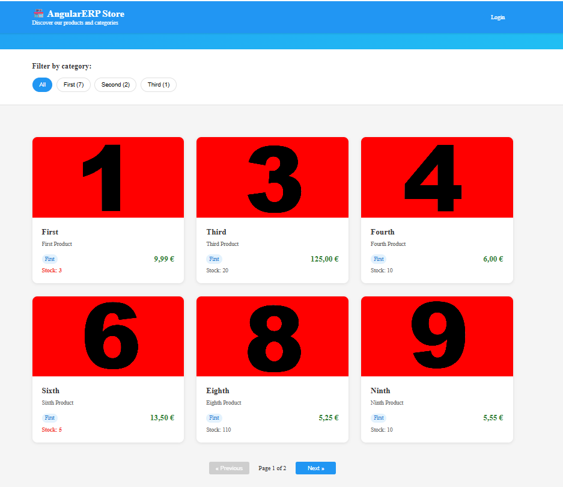
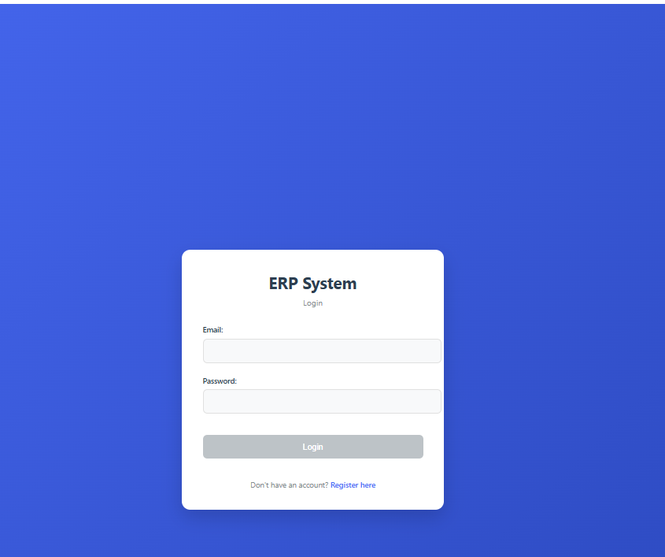
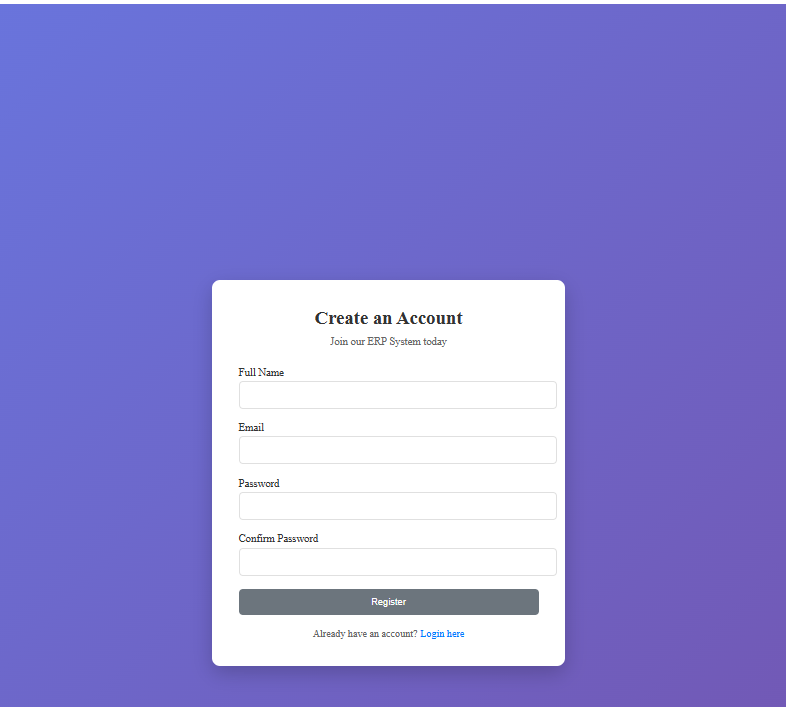
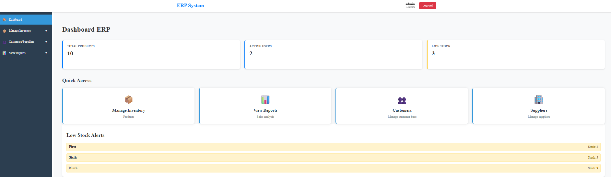
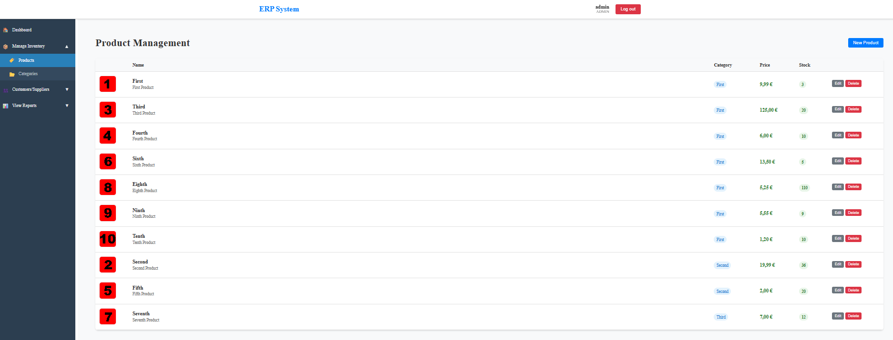
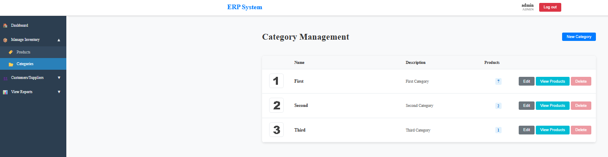
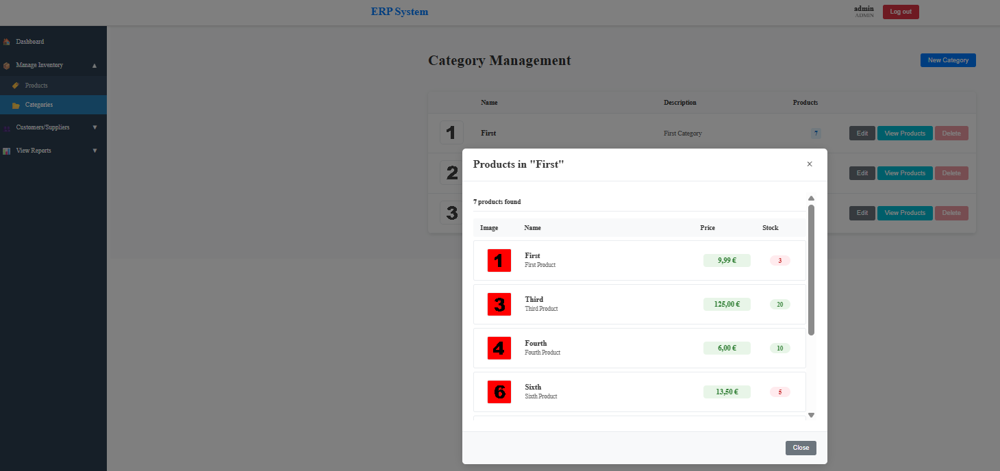
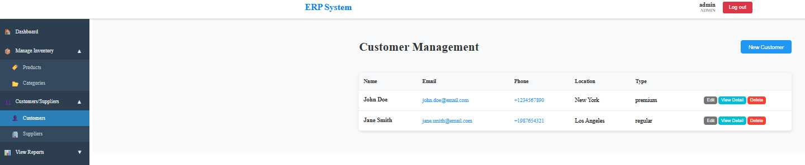
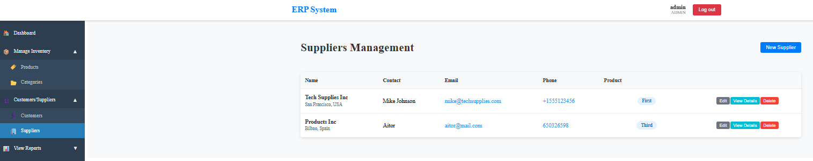

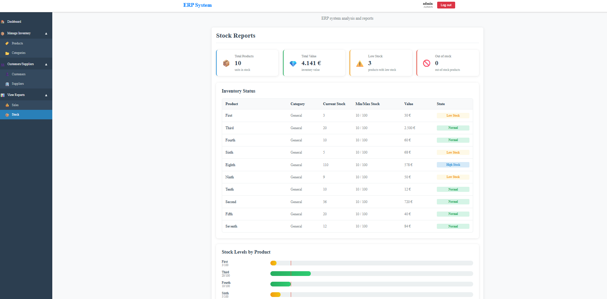
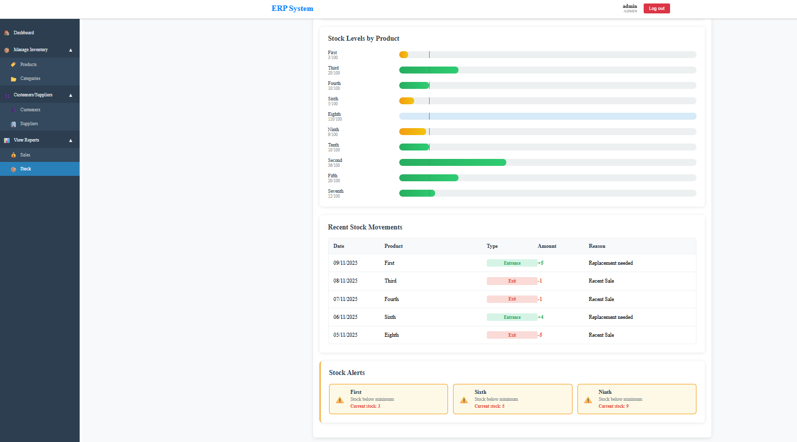
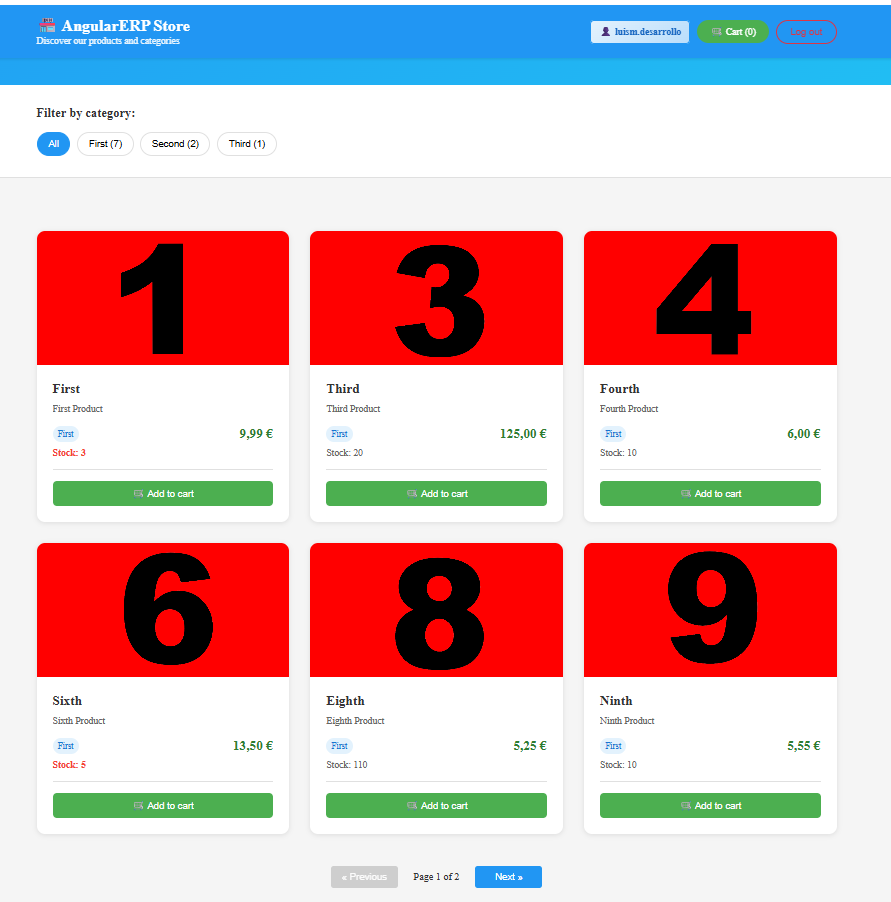
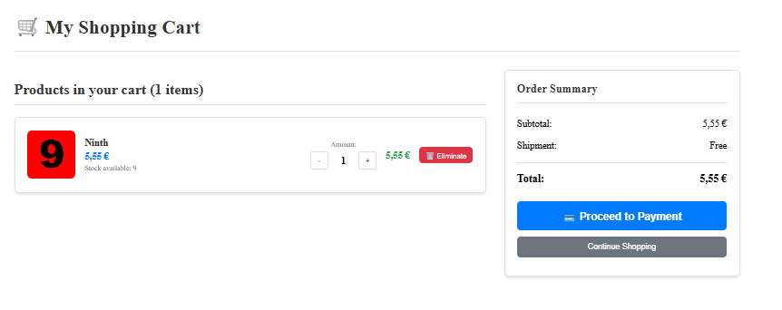


## environment

```javascript
export const environment = {
  production: false,
  apiUrl: 'http://localhost:5002', // ProductsAPI by default
  microservices: {
    users: 'http://localhost:5001',
    products: 'http://localhost:5002',
    customers: 'http://localhost:5003',
    suppliers: 'http://localhost:5004',
    shopping: 'http://localhost:5007',
    reports: 'http://localhost:5009',
  },
};


```
## Administrator Credentials
- **Email**: admin@erp.com
- **Password**: admin123

[DeepWiki moraisLuismNet/AngularERP](https://deepwiki.com/moraisLuismNet/AngularERP)
